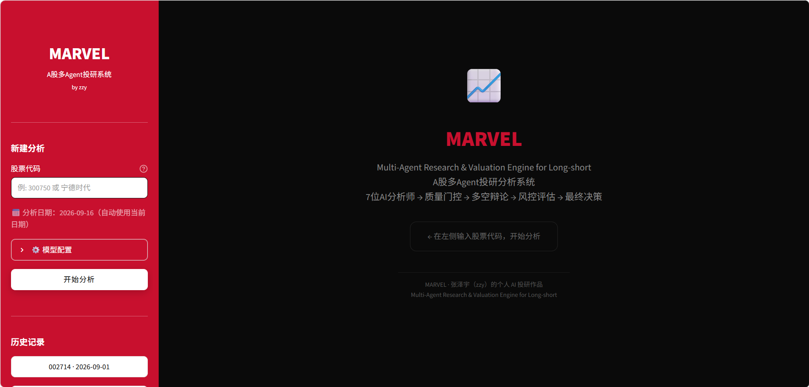

<h1 align="center">MARVEL</h1>
<p align="center">Multi-Agent Research & Valuation Engine for Long-short</p>

<p align="center">
  基于 <a href="https://github.com/TauricResearch/TradingAgents">TauricResearch/TradingAgents</a> 的 A 股深度特化 fork<br>
  直接上游：<a href="https://github.com/simonlin1212/tradingagents-astock">simonlin1212/TradingAgents-Astock</a> v0.2.13（并移植其至 v0.5.17 的修复）<br>
  混合许可（Apache 2.0 + PolyForm NC 1.0.0）· pip install 即跑 · 零外部服务依赖
</p>

<p align="center">
  <b>🚫 本项目仅供非商业的研究与教学使用，禁止商用。</b><br>
  许可构成见 <a href="./LICENSING.md">LICENSING.md</a>。<br>
  <b>⚠️ 免责声明：仅供学习研究与技术演示，不构成任何投资建议。投资决策请咨询持牌专业机构。</b>
</p>

<p align="center">
  <a href="https://github.com/ZeyuChang0471/marvel/stargazers"></a>
  <a href="https://github.com/ZeyuChang0471/marvel/network/members"></a>
  <a href="https://arxiv.org/abs/2412.20138"></a>
  <a href="./LICENSING.md"></a>
  <a href="./CHANGES_FROM_UPSTREAM.md"></a>
  <!-- 上游 star 数用实时徽章：写死的数字必然过时（曾写 65K，实际早已远超此数） -->
  <a href="https://github.com/TauricResearch/TradingAgents"></a>
</p>

---

## 目录

- [为什么做这个 Fork](#为什么做这个-fork)
- [与上游对比](#与上游对比)
- [架构概览](#架构概览)
- [9 个 Analyst 角色](#9-个-analyst-角色)
- [数据源](#数据源)
- [快速开始](#快速开始)
- [Web UI](#web-ui)
- [配置说明](#配置说明)
- [项目结构](#项目结构)
- [致谢](#致谢)
- [Donate](#donate)
- [许可证](#许可证)

---

## 为什么做这个 Fork

原版 TradingAgents 是一个出色的多 Agent 投研框架，但它针对美股设计：数据走 Yahoo Finance / Alpha Vantage，分析师不懂 A 股制度，辩论和决策完全面向美股市场。

**本 Fork 的目标**：把 TradingAgents 的多 Agent 辩论架构真正落地到 A 股，不是简单翻译，而是从数据层、Agent 角色、交易规则三个维度做深度特化。

### 核心改造

| 维度 | 原版 | 本 Fork |
|------|------|---------|
| **数据源** | Yahoo Finance / Alpha Vantage | mootdx + 东财 + 新浪 + 同花顺（全免费直连） |
| **Analyst 角色** | 4 个（市场/情绪/新闻/基本面） | **9 个**（+政策/游资/解禁/量价/宏观） |
| **交易规则** | 美股（T+0、无涨跌停） | A 股（T+1、涨跌停、最小手数、交易时段） |
| **输出语言** | 英文 | 中文报告（内部辩论保持英文以保证推理质量） |
| **Alpha 基准** | SPY | 沪深 300（CSI 300） |

---

## 与上游对比

| 特性 | 原版 TradingAgents | **本 Fork（MARVEL）** |
|------|-------------------|-------------|
| 许可证 | Apache 2.0 | **Apache 2.0 + PolyForm NC 1.0.0（仅限非商业）** |
| 部署依赖 | pip install | **开箱即用** |
| A 股数据 | ❌ | **mootdx + 东财 + 新浪 + 同花顺（直连 HTTP）** |
| A 股特化角色 | ❌ | **政策/游资/解禁/量价/宏观 5 个深度角色** |
| A 股交易约束 | ❌ | **T+1/涨跌停/手数/ST 全覆盖** |

---

## 架构概览

```
┌─────────────────────────────────────────────────────────┐
│                    9 Analyst 研报生成                      │
│  Market → Volume-Price → Social → News → Fundamentals     │
│  → Policy → Hot Money → Lockup → Macro                    │
│         （每个 Analyst 带工具循环）                          │
├─────────────────────────────────────────────────────────┤
│                 数据质量门控 (Quality Gate)                 │
│         硬检查（代码）+ LLM 复审，逐份报告评级               │
├─────────────────────────────────────────────────────────┤
│               Bull vs Bear 投研辩论                       │
│         Bull Researcher ←→ Bear Researcher               │
│               （最多 N 轮辩论）                             │
├─────────────────────────────────────────────────────────┤
│              Research Manager 综合研判                     │
│         （深度思考 LLM，输出投资计划）                       │
├─────────────────────────────────────────────────────────┤
│                  Trader 交易方案                          │
│         （A 股约束：T+1/涨跌停/手数；不含可执行价位）         │
├─────────────────────────────────────────────────────────┤
│        Aggressive ←→ Conservative ←→ Neutral             │
│               三方风险辩论                                 │
├─────────────────────────────────────────────────────────┤
│            Portfolio Manager 最终决策                      │
│   （深度思考 LLM，输出 5 档评级 Buy/Overweight/Hold/        │
│    Underweight/Sell；不含仓位、止损、目标价）                │
└─────────────────────────────────────────────────────────┘
```

进度条共 **14 个阶段**：9 个分析师 → 质量门控 → 投研辩论 → 交易 → 风控 → 最终决策
（与 `web/progress.py` 的 `PIPELINE_STAGES` 一致）。

**双 LLM 设计**：
- `quick_think_llm`：所有 Analyst、Researcher、Trader、Risk Debater
- `deep_think_llm`：Research Manager 和 Portfolio Manager（需要综合全局信息做决策）

---

## 9 个 Analyst 角色

### 原版 4 角色（A 股适配）

| 角色 | 职责 | 数据工具 |
|------|------|---------|
| 🏪 市场分析师 | K 线形态、技术指标、量价分析 | `get_stock_data`, `get_indicators` |
| 💬 舆情分析师 | 社交媒体情绪、散户讨论热度 | `get_news` |
| 📰 新闻分析师 | 行业新闻、公告、宏观事件 | `get_news`, `get_global_news`, `get_insider_transactions` |
| 📊 基本面分析师 | 财报三表、盈利能力、估值 | `get_fundamentals`, `get_balance_sheet`, `get_cashflow`, `get_income_statement` |

### A 股特化 5 角色（新增）

| 角色 | 职责 | 数据工具 | 为什么需要 |
|------|------|---------|-----------|
| 🏛️ 政策分析师 | 监管政策、产业政策、窗口指导 | `get_news`, `get_global_news` | A 股是政策市，政策变化直接影响板块轮动 |
| 🔥 游资追踪师 | 龙虎榜、大单流向、主力资金动态 | `get_stock_data`, `get_news`, `get_insider_transactions`, `get_hot_stocks`, `get_northbound_flow`, `get_fund_flow`, `get_dragon_tiger_board` | 游资是 A 股短线定价的核心力量 |
| 🔓 解禁监控师 | 限售股解禁、大股东减持、股权质押 | `get_insider_transactions`, `get_news`, `get_fundamentals`, `get_lockup_expiry` | 解禁是 A 股特有的重大供给冲击因素 |
| 📉 量价分析师 | Wyckoff / Anna Coulling 量价体系：量在价先、吸筹与派发、封板质量 | `get_stock_data`, `get_indicators` | 单纯的技术指标看不出量价配合，A 股的量价关系尤其关键 |
| 🌐 宏观板块分析师 | 板块轮动、政策传导路径、行业横向对比 | `get_industry_comparison`, `get_concept_blocks`, `get_northbound_flow`, `get_news`, `get_global_news` | 个股走势高度依赖所处板块与资金轮动方向 |

所有 9 个 Analyst 的报告会流入后续的 Bull/Bear 辩论和三方风险辩论，确保 A 股特色因素贯穿整条决策链。

---

## 数据源

全部免费，无需 API Key，无积分墙：

| 来源 | 协议 | 提供内容 |
|------|------|---------|
| **mootdx** | TCP 7709 | OHLCV K 线、财务快照、F10 文本 |
| **腾讯财经** | HTTP (`qt.gtimg.cn`) | PE / PB / 市值 / 换手率（实时） |
| **东方财富** | HTTP (datacenter / push2) | 龙虎榜、限售解禁、板块行情、个股信息 |
| **新浪财经** | HTTP | K 线历史、财报三表 |
| **同花顺** | HTTP (10jqka) | EPS 一致预期 |
| **财联社** | HTTP (cls.cn) | 全球财经快讯 |
| **百度股市通** | HTTP (finance.pae.baidu) | 概念板块归属（K 线带 MA 备用源） |

> 完全不依赖 Tushare（积分墙）、Alpha Vantage（海外 API）、Yahoo Finance（不支持 A 股）。

---

> **数据源优先级 & 东财防封（v0.2.11）**：行情 / K线 / 市值 / 财务能从 mootdx（通达信 TCP，不封 IP）或腾讯拿到的，一律走它们；东财只用于它独有的数据（龙虎榜 / 解禁 / 资金流 / 板块 / 个股新闻等）。所有东财请求统一走内置节流入口 `_em_get()`：串行限流（默认间隔 ≥1s + 0.1~0.5s 随机抖动）+ 复用 Keep-Alive 会话，多 Agent 跑批量分析不再触发临时封 IP（东财风控实测：每秒 >5 / 并发 ≥10 / 1 分钟 ≥200 触发封禁）。批量场景可设环境变量 `EM_MIN_INTERVAL=1.5~2` 进一步降速。**仅东财限流，mootdx / 腾讯 / 新浪 / 同花顺 / 财联社 / 百度 不受影响。**

## 快速开始

### 1. 环境准备

```bash
# Python >= 3.10
git clone https://github.com/ZeyuChang0471/marvel.git
cd marvel
pip install -e .
```

> **⚠️ 没有 `[google]` extra，Gemini 默认装不上**：mootdx 依赖 `httpx>=0.25,<0.26`，
> 而 `langchain-google-genai` 要求 `httpx>=0.28.1`，声明成 extra 会是一个 pip 解析
> 不出来的组合（所以本仓库已经不声明它了）。要用 Gemini，按 `marvel/llm_clients/google_client.py`
> 报错信息里的命令显式安装：
>
> ```bash
> pip install --no-deps "langchain-google-genai>=4.0.0"
> pip install "google-genai>=1.53.0" "httpx>=0.28.1"
> ```
>
> （mootdx 走 TCP、运行时并不 import httpx，所以抬 httpx 实际是安全的。）
> 其余供应商——OpenAI / DeepSeek / Qwen / GLM / MiniMax / Anthropic / xAI——开箱可用。

### 2. 配置 LLM

> **必须使用 API Key**，不能用 Claude/ChatGPT 订阅版。每次分析需 30-50 次 LLM 调用，只有 API 模式支持。

**方式一 · Web UI 里直接填（推荐，无需重启）**：启动后展开左侧栏「⚙️ 模型配置」→ 选好「LLM 供应商」→ 在 **API Key** 输入框粘贴 Key 并按回车。Key 会立即对当前会话生效，同时写入项目根目录的 `.env`（该文件已被 `.gitignore` 忽略，不会被提交）。把输入框清空再回车即可清除已保存的 Key。

**方式二 · 手写 `.env`（CLI / Docker 用这个）**：在项目根目录创建 `.env` 文件，按你选择的供应商配置：

```bash
# ── 方案 A：MiniMax（推荐，国内直连，性价比高）──────────
MINIMAX_API_KEY=sk-xxx
# 申请地址：https://platform.minimaxi.com/

# ── 方案 B：DeepSeek ─────────────────────────────────
DEEPSEEK_API_KEY=sk-xxx
# 申请地址：https://platform.deepseek.com/

# ── 方案 C：智谱 GLM ─────────────────────────────────
ZHIPU_API_KEY=xxx
# 申请地址：https://open.bigmodel.cn/

# ── 方案 D：通义千问 Qwen ────────────────────────────
DASHSCOPE_API_KEY=sk-xxx
# 申请地址：https://dashscope.console.aliyun.com/

# ── 方案 E：OpenAI ───────────────────────────────────
OPENAI_API_KEY=sk-xxx

# ── 方案 F：Anthropic ────────────────────────────────
ANTHROPIC_API_KEY=sk-ant-xxx

# ── 方案 G：Kimi（Anthropic 兼容 API）────────────────
ANTHROPIC_AUTH_TOKEN=your-kimi-token
```

### 3. 运行分析

根据你选择的供应商修改 config：

```python
from marvel.graph.trading_graph import MarvelGraph

# ── MiniMax 示例（推荐）─────────────────────────────
config = {
    "llm_provider": "minimax",
    "deep_think_llm": "MiniMax-M2.7",
    "quick_think_llm": "MiniMax-M2.7-highspeed",
    "output_language": "Chinese",
}

# ── DeepSeek 示例 ───────────────────────────────────
# config = {
#     "llm_provider": "deepseek",
#     "deep_think_llm": "deepseek-chat",
#     "quick_think_llm": "deepseek-chat",
#     "output_language": "Chinese",
# }

# ── Anthropic + Kimi 示例 ───────────────────────────
# config = {
#     "llm_provider": "anthropic",
#     "deep_think_llm": "claude-sonnet-4-6",
#     "quick_think_llm": "claude-sonnet-4-6",
#     "backend_url": "https://api.kimi.com/coding/",
#     "output_language": "Chinese",
# }

ta = MarvelGraph(debug=True, config=config)
final_state, decision = ta.propagate("688017", "2026-05-12")
print(decision)
```

### 4. CLI 方式

```bash
marvel            # 交互式 CLI
marvel --help     # 查看所有选项
```

---

## Web UI

内置 Streamlit 可视化界面，支持在侧边栏选择 LLM 供应商和模型，输入股票代码即可一键分析，适合不写代码的用户。

### 启动

```bash
# 方式一：命令行启动（推荐）
marvel-web

# 方式二：直接运行
streamlit run web/app.py
```

打开浏览器访问 `http://localhost:8501`。

### 功能

- **模型自选**：侧边栏支持 9 个 LLM 供应商切换（MiniMax/DeepSeek/Qwen/GLM/OpenAI/Anthropic/Google/xAI/Ollama）
- **一键分析**：输入 6 位 A 股代码 + 日期，点击「开始分析」
- **实时进度**：14 阶段 pipeline 实时显示（9 分析师 → 质量门控 → 辩论 → 交易 → 风控 → 决策），所有已完成阶段的报告均可展开查看
- **完整报告**：信号卡片（Buy/Overweight/Hold/Underweight/Sell 5 档）、9 份分析师报告、数据质量门控、多空辩论、风控评估
- **报告导出**：一键下载 **Markdown**（零依赖，永远可用）或 **PDF** 完整分析报告（PDF 自动适配 Windows/macOS/Linux 中文字体）
- **历史记录**：自动保存并展示所有历史分析

### 截图

<p align="center">
  
</p>

---

## 配置说明

所有配置通过 `config` 字典传入，完整选项：

| 参数 | 默认值 | 说明 |
|------|--------|------|
| `llm_provider` | `"openai"` | LLM 提供商：`openai` / `deepseek` / `qwen` / `glm` / `minimax` / `anthropic` / `google` / `xai` / `openrouter` / `azure` / `ollama` |
| `deep_think_llm` | `"gpt-5.4"` | Research Manager + Portfolio Manager 用的模型 |
| `quick_think_llm` | `"gpt-5.4-mini"` | 所有 Analyst / Researcher / Trader 用的模型 |
| `backend_url` | `None` | 自定义 API 端点 / 第三方中转网关。可在 Web UI 侧边栏填写，或用 `.env` 的 `BACKEND_URL`；方便国内通过代理访问 Claude / OpenAI |
| `output_language` | `"Chinese"` | 报告输出语言（内部辩论始终英文） |
| `max_debate_rounds` | `1` | Bull vs Bear 辩论轮数 |
| `max_risk_discuss_rounds` | `1` | 风险三方辩论轮数 |
| `data_vendors` | 全部 `"a_stock"` | 数据供应商路由 |
| `checkpoint_enabled` | `False` | 启用 SQLite 断点续跑（**注意：目前只有 Web UI 走这条路径，CLI 尚未接入，见下方「已知问题」**） |
| `memory_log_max_entries` | `None` | 交易记忆最大条目数 |
| `max_recur_limit` | `100` | LangGraph 步数上限。**当前版本该配置尚未接线**（`Propagator()` 用的是内置默认值），需要更大的预算请改代码 |

> 上表取自 `marvel/default_config.py`。Web UI 会覆盖其中几项：
> 供应商／模型来自侧边栏，`max_debate_rounds` / `max_risk_discuss_rounds` 固定为 `1`，
> `output_language` 固定为 `Chinese`（见 `web/app.py::_build_config`）。

---

## 常见问题排错

**Q: 用 DeepSeek/通义/智谱，却报 `OpenAIError: The api_key client option must be set ... OPENAI_API_KEY`？**
每个供应商用**各自的环境变量**，不是 OPENAI_API_KEY：DeepSeek=`DEEPSEEK_API_KEY`、通义=`DASHSCOPE_API_KEY`、智谱=`ZHIPU_API_KEY`、MiniMax=`MINIMAX_API_KEY`、xAI=`XAI_API_KEY`、OpenRouter=`OPENROUTER_API_KEY`。Web UI 用户直接在侧边栏「模型配置」的 **API Key** 输入框粘贴后回车即可（立即生效、无需重启）；CLI / Docker 场景则在项目根目录 `.env` 里设置对应变量后**重启**程序。（v0.2.12 起缺 key 会直接提示该用哪个变量名。）

**Q: 导出 PDF 报 `UnicodeEncodeError: 'latin-1' codec can't encode`？**
你的环境里装了**旧版 `fpdf`（pyfpdf）**，它和本项目用的 `fpdf2` 都以 `fpdf` 名称导入、互相冲突。执行：`pip uninstall -y fpdf && pip install "fpdf2>=2.8.0"`。实在不行可改用「下载 Markdown」导出（零依赖，永远可用）。

**Q: Docker 里导出 PDF 报「未找到中文字体」？**
v0.2.12 起 Dockerfile 已内置 `fonts-noto-cjk`，重新 `docker build` 即可。旧镜像可临时 `apt install fonts-noto-cjk`，或改用 Markdown 导出。

**Q: 部分分析师报告（情绪/新闻/基本面/政策/游资/解禁）空白不显示？**
这些报告由对应 Analyst 调用数据工具后生成，**空报告会被自动跳过不显示**。数据源本身是健康的（腾讯/mootdx/同花顺/东财实测出数）；报告为空通常是**所选模型 tool-call 能力弱**（如部分 deepseek/minimax 轻量模型不稳定地调用工具）。建议换用 tool-call 更稳的模型（deepseek-chat / 通义 / GLM-4 / Claude / GPT 等），或重试。

---

## 项目结构

```
MARVEL/
├── marvel/
│   ├── agents/
│   │   ├── analysts/          # 9 个分析师
│   │   │   ├── market_analyst.py
│   │   │   ├── social_media_analyst.py
│   │   │   ├── news_analyst.py
│   │   │   ├── fundamentals_analyst.py
│   │   │   ├── policy_analyst.py        # A 股特化
│   │   │   ├── hot_money_tracker.py     # A 股特化
│   │   │   ├── lockup_watcher.py        # A 股特化
│   │   │   ├── volume_price_analyst.py  # A 股特化（PolyForm NC）
│   │   │   └── macro_analyst.py         # A 股特化（PolyForm NC）
│   │   ├── quality_gate.py    # 数据质量门控（硬检查 + LLM 复审）
│   │   ├── researchers/       # Bull / Bear 研究员
│   │   ├── risk_mgmt/         # 激进 / 保守 / 中立 辩手
│   │   ├── managers/          # Research Manager + Portfolio Manager
│   │   ├── trader/            # Trader（A 股交易约束）
│   │   ├── schemas.py         # 结构化输出 schema（不含可执行价位）
│   │   └── utils/             # 状态定义、评级解析、工具函数、记忆日志
│   ├── dataflows/
│   │   ├── a_stock.py         # A 股数据 vendor（直连 HTTP API，零第三方库）
│   │   ├── trade_calendar.py  # A 股交易日历（PolyForm NC）
│   │   ├── interface.py       # 数据接口抽象层（vendor 路由）
│   │   └── ...                # yfinance / alpha_vantage 等非 A 股 vendor
│   ├── graph/
│   │   ├── trading_graph.py   # 主入口：MarvelGraph
│   │   ├── setup.py           # LangGraph 拓扑定义
│   │   ├── propagation.py     # 状态初始化与传播
│   │   ├── reflection.py      # 交易反思（CSI 300 基准）
│   │   ├── checkpointer.py    # SQLite 断点续跑
│   │   └── conditional_logic.py
│   ├── llm_clients/           # 各 provider 客户端与模型能力表
│   └── default_config.py      # 默认配置
├── cli/                       # 交互式 CLI（marvel）
├── web/
│   ├── app.py                 # Streamlit 主入口
│   ├── runner.py              # 后台线程运行分析
│   ├── progress.py            # 线程安全进度追踪
│   ├── history.py             # 历史记录扫描
│   ├── stock_display.py       # 「代码+名称」显示归一化
│   ├── pdf_export.py          # PDF 报告生成（跨平台 CJK 字体）
│   ├── launch.py              # marvel-web 启动器
│   └── components/            # UI 组件
│       ├── sidebar.py         # 侧边栏（输入 + 历史）
│       ├── progress_panel.py  # 实时进度面板
│       └── report_viewer.py   # 报告展示
├── scripts/                   # 手工探针（会打真实网络/计费调用，勿当测试跑）
│   ├── probe_astock_e2e.py
│   ├── probe_data_quality.py
│   ├── probe_yfinance_indicators.py
│   └── smoke_structured_output.py
├── tests/                     # pytest 离线测试（23 个文件）
├── examples/                  # 批量示例（产物需经脱敏，见 run_cases.py）
├── issues/                    # 直接上游的 Issue 归档
├── assets/                    # README 配图
├── run.py                     # 一键入口（CLI / Web / 快速测试）
├── run_single.py              # 单股分析入口（供批量脚本调用）
├── start.bat                  # Windows 一键启动（菜单：Web / 单股 / 批量）
├── start.sh                   # Linux / macOS / Git Bash 一键启动
├── CHANGES_FROM_UPSTREAM.md   # 与上游的完整改动记录
├── LICENSING.md               # 逐组件许可说明（先读这个）
├── NOTICE                     # 归属与修改声明
├── LICENSE                    # Apache 2.0 许可证
├── LICENSE-TradingAgents-AShare.txt  # PolyForm NC 1.0.0 许可证
└── pyproject.toml             # 包定义与依赖
```

---

## 致谢与代码血缘

```
TauricResearch/TradingAgents ──fork──▶ simonlin1212/TradingAgents-Astock ──fork──▶ MARVEL
     （原版框架 · Apache 2.0）              （A 股特化 · Apache 2.0）          （本仓库 · 混合许可）

KylinMountain/TradingAgents-AShare ──提取──▶ MARVEL
        （PolyForm Noncommercial 1.0.0）
```

- **原版框架**：[TauricResearch/TradingAgents](https://github.com/TauricResearch/TradingAgents)，感谢原作者的出色工作与 Apache 2.0 开源精神
- **直接上游**：[simonlin1212/TradingAgents-Astock](https://github.com/simonlin1212/tradingagents-astock)，本仓库的 A 股数据层与分析师实现来自该项目；基线为 v0.2.13，并已移植其至 v0.5.17 的数据层 / Agent / LLM 客户端修复
- **代码提取来源**：[KylinMountain/TradingAgents-AShare](https://github.com/KylinMountain/TradingAgents-AShare)，PolyForm Noncommercial 1.0.0；当前提取了 4 个文件——交易日历 `trade_calendar.py`、量价分析师 `volume_price_analyst.py`、宏观分析师 `macro_analyst.py`、辩论议题 `debate_utils.py`（完整清单见 [LICENSING.md](./LICENSING.md)）
- **MARVEL 的改动**：见 [NOTICE](./NOTICE) 与 [CHANGES_FROM_UPSTREAM.md](./CHANGES_FROM_UPSTREAM.md)

**原始论文**：[TradingAgents: Multi-Agents LLM Financial Trading Framework](https://arxiv.org/abs/2412.20138)

---

## 许可证

**本项目是混合许可项目，且仅限非商业用途。**

| 来源 | 许可证 |
|------|--------|
| TauricResearch/TradingAgents、simonlin1212/TradingAgents-Astock | [Apache License 2.0](./LICENSE) |
| KylinMountain/TradingAgents-AShare（提取部分） | [PolyForm Noncommercial 1.0.0](./LICENSE-TradingAgents-AShare.txt) |
| MARVEL 自身贡献 | 仅授权非商业用途 |

**🚫 由于包含 PolyForm Noncommercial 组件，本仓库整体不得用于商业目的。**

> 有一点必须说清：Apache 2.0 已向每一位接收者授予**不可撤销的、含商业使用在内**的许可，
> 原作者与本仓库都**无权替那部分代码收回该权利**。因此本声明不对 Apache 部分主张
> 「禁止商用」——那在法律上无效。想要一份可商用的构建，需删除 PolyForm NC 清单中的文件。
> 完整说明见 **[LICENSING.md](./LICENSING.md)**。

> 想要什么功能？欢迎开 [Issue](https://github.com/ZeyuChang0471/marvel/issues) 提需求。

---

## 免责声明

> **本项目仅供学习研究与技术演示，不构成任何投资建议。**
>
> - 本系统产出的所有分析报告和交易信号均由 AI 自动生成，可能存在错误或偏差
> - 投资决策请咨询持有中国证监会颁发资质的专业机构
> - 作者不对使用本工具产生的任何投资损失承担责任
> - 股市有风险，投资需谨慎
